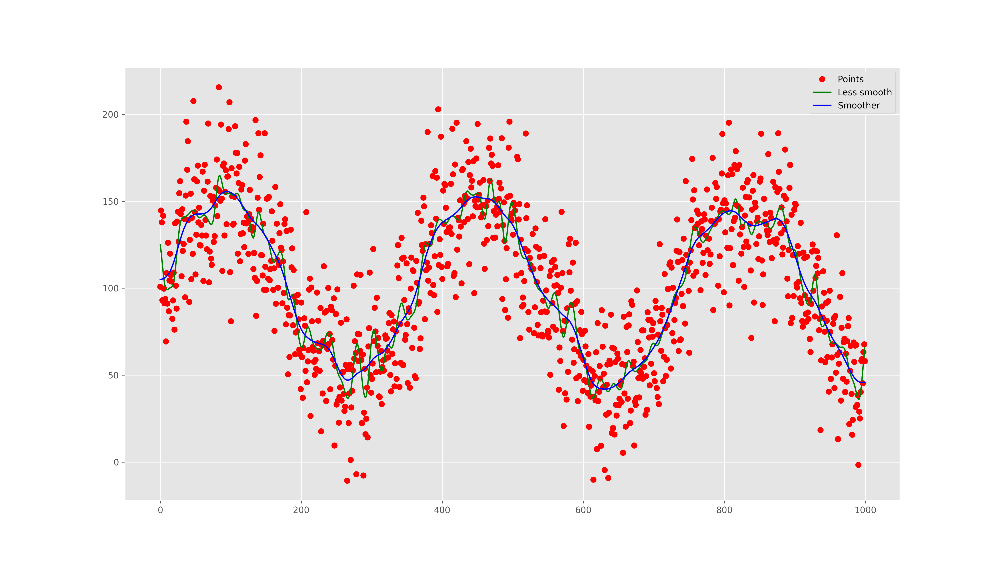

# pysmoothspl
Python wrapper around R's lovely `smooth.spline`

## Example

``` python
import matplotlib.pyplot as plt
import numpy as np
from pysmoothspl import SmoothSpline

n = 1000
x = np.arange(n).astype(np.float)
y = 100 + 50 * np.sin(2 * np.pi * x / 365.0) + np.random.normal(0, 25, n)

spl = SmoothSpline(spar=0.2).fit(x, y)
yhat = spl.predict(x)
spl_smoother = SmoothSpline(spar=0.5).fit(x, y)
yhat_smoother = spl_smoother.predict(x)

fig, ax = plt.subplots(1, figsize=(16, 9))
ax.plot(x, y, 'ro', label='Points')
ax.plot(x, yhat, 'g-', label='Less smooth')
ax.plot(x, yhat_smoother, 'b-', label='Smoother')
ax.legend()
fig.show()
```



## TODO

* [x] Object oriented sklearn-esque estimator
* [ ] Kill the GIL
* [ ] CI service tests
    * [ ] Code coverage checks with CI
* [x] Check output against literal R output via rpy2
* [ ] Implement more features
    * [ ] Cross validation
    * [ ] Derivatives (hint: check `bvalue` code for commented out)
* [ ] Work back from fresh copy of R code...
